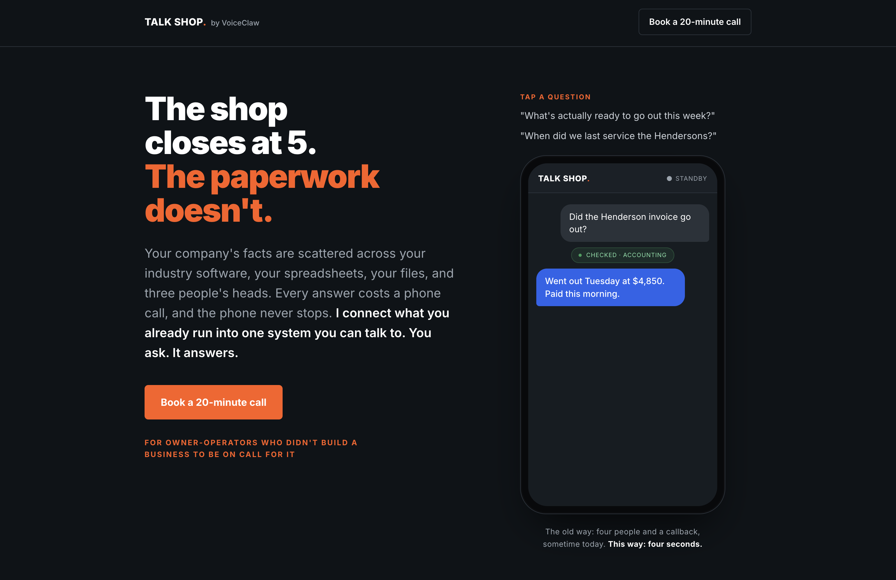

# TALK SHOP by VoiceClaw

**Live site: [ianpilon.github.io/second-brain-landing](https://ianpilon.github.io/second-brain-landing/)**

Landing page for TALK SHOP, a managed service for owner-operated businesses (5 to 50 people) where the owner is still the one answering the phone. TALK SHOP connects the systems a business already runs (industry software, spreadsheets, files, paper) into one system the owner can ask questions in plain language.

Positioning: the owner's problem is disconnection. The facts of the business are scattered across systems and people's heads, so every answer costs a phone call. TALK SHOP makes the business answerable.

Single static page (`index.html`), no build step. Deployed with GitHub Pages from `main`.
